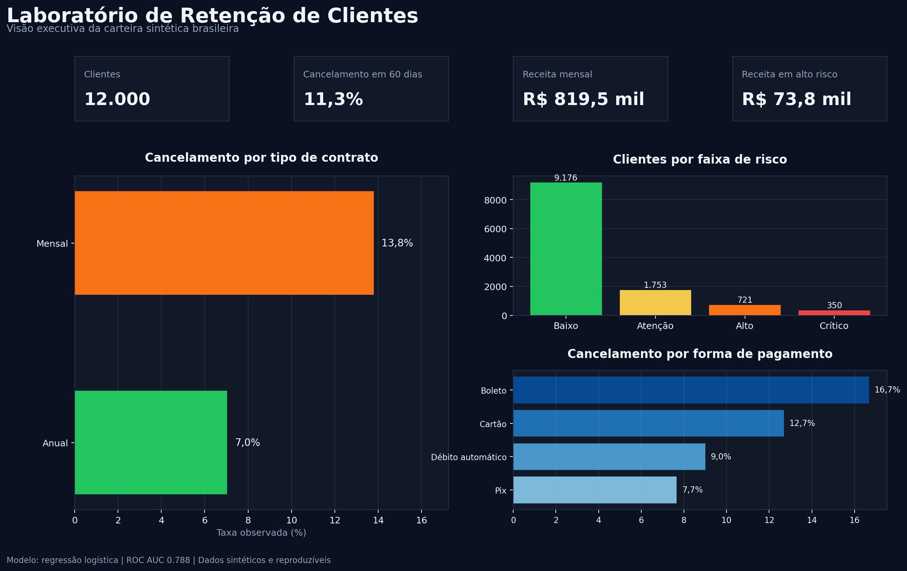
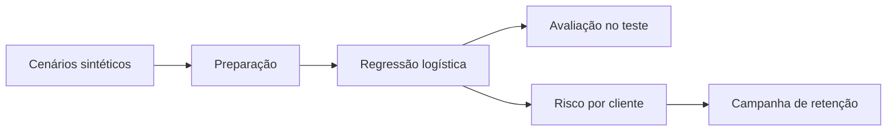

# Laboratório de Retenção de Clientes

[](https://www.python.org/)
[](https://streamlit.io/)
[](https://scikit-learn.org/)
[](tests/)
[](LICENSE)

Aplicação de Ciência de Dados para analisar cancelamentos, estimar risco nos próximos 60 dias e testar cenários de campanha de retenção.

O projeto foi construído para responder uma pergunta operacional: quais clientes merecem atenção primeiro, por quais motivos e qual retorno uma campanha poderia gerar?



## Acesse a aplicação

O link será incluído após a publicação no Streamlit Community Cloud.

## O que é possível fazer

- filtrar a carteira por plano, contrato e canal de aquisição;
- comparar taxa, volume, receita mensal e lift por segmento;
- visualizar clientes nas faixas baixo, atenção, alto e crítico;
- simular um perfil e obter a probabilidade de cancelamento;
- entender quais fatores aumentaram ou reduziram a previsão;
- priorizar clientes para uma campanha;
- estimar custo, retenções esperadas, margem preservada e ROI potencial;
- alterar o limiar do modelo e observar precisão, recall e matriz de confusão;
- baixar a base sintética, o recorte filtrado e a lista priorizada.

## Resultados

A base sintética contém 12.000 clientes e taxa de cancelamento de 11,3%. A avaliação usa 25% dos registros, separados do treinamento.

| Métrica | Resultado | Interpretação |
| --- | ---: | --- |
| ROC AUC | 0,788 | Capacidade de ordenar clientes de menor e maior risco |
| Acurácia | 83,2% | Proporção total de classificações corretas |
| Precisão | 33,9% | Entre os sinalizados, quantos cancelaram |
| Recall | 50,9% | Entre os cancelamentos, quantos foram identificados |
| Brier Score | 0,086 | Qualidade das probabilidades; menor é melhor |

Precisão, recall e acurácia usam limiar de 20%. O aplicativo permite alterar o limite porque a escolha depende do custo de abordagem e do valor do cliente.

## Exemplo de cenário de campanha

Com capacidade para 800 clientes, custo de R$ 18 por contato, efetividade hipotética de 20%, horizonte de seis meses e margem de contribuição de 70%, o simulador estima:

- 81 retenções esperadas;
- R$ 23,6 mil de margem preservada;
- R$ 14,4 mil de custo;
- R$ 9,2 mil de retorno líquido potencial;
- ROI potencial de 64%.

Esses números dependem das premissas e não comprovam impacto. Uma empresa precisaria validar a campanha com grupo de controle.

## Dados sintéticos e reproduzíveis

A base anterior foi removida porque não possuía origem, licença ou processo de coleta documentados. A nova versão gera clientes fictícios de um serviço brasileiro por assinatura.

Nenhum registro representa uma pessoa real. O projeto não usa idade, sexo, localização, raça ou estado civil. A geração pode ser reproduzida com a mesma semente.

Leia [dados e metodologia](docs/dados_e_metodologia.md) e [decisões do projeto](docs/decisoes_do_projeto.md).

## Fluxo



## Estrutura

```text
.
├── app.py
├── assets/
│   ├── capa_linkedin.png
│   └── painel_retencao.png
├── data/
│   └── clientes_assinatura_sinteticos.csv
├── docs/
│   ├── dados_e_metodologia.md
│   └── decisoes_do_projeto.md
├── scripts/
│   ├── gerar_dados.py
│   └── gerar_visualizacoes.py
├── src/
│   ├── analysis.py
│   ├── data.py
│   └── model.py
├── tests/
├── train.py
└── requirements.txt
```

## Como executar

```bash
python3 -m venv .venv
source .venv/bin/activate
python -m pip install -r requirements.txt
python -m streamlit run app.py
```

No Windows, ative o ambiente com `.venv\Scripts\activate`.

## Reproduzir dados, visual e testes

```bash
python -m scripts.gerar_dados
python -m scripts.gerar_visualizacoes
python -m pytest -q
```

Para treinar e salvar o pipeline:

```bash
python train.py
```

## Tecnologias

- Python para organização do projeto;
- pandas para preparação e análise;
- scikit-learn para pipeline, regressão logística e métricas;
- Streamlit para a aplicação;
- Plotly e Matplotlib para visualizações;
- pytest para testes automatizados.

## Limites de uso

Este é um projeto de portfólio com dados sintéticos. As probabilidades não foram calibradas em uma empresa e a efetividade de campanha é uma hipótese. O aplicativo apoia estudo e planejamento, mas não substitui experimentação, governança ou decisão humana.

## Autor

Bruno Nunes, Ciência de Dados e Inteligência Artificial.
